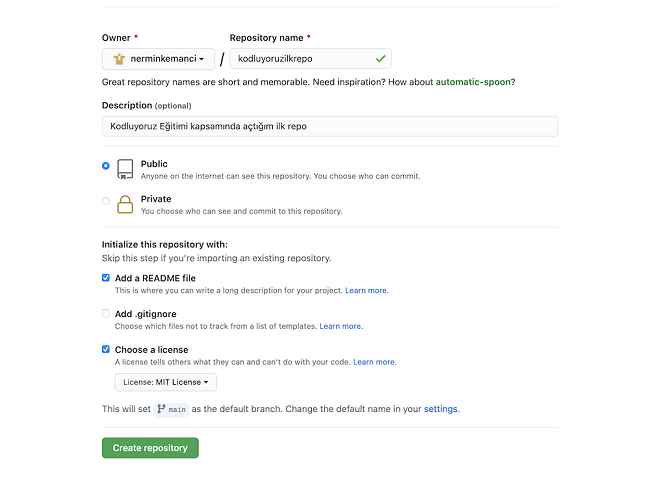

# Kodluyoruz Ilk Repo

Bu repo <u>[Kodluyoruz](https://www.kodluyoruz.org)</u> Front-End Eğitiminde oluşturduğumuz ilk repo. İçerisinde bir adet README dosyası, bir adet de index.html barındırıyor.




## Installation

Öncelikle projeyi clonelayın. (Buraya sizin reponuzdan aldığınız link gelecek)

```bash
git clone https://github.com/nerminkemanci/kodluyoruzilkrepo.git
```


## Usage

Projeyi cloneladıktan sonra Visual Studio Code programında açınız.

Linux için:
```linux
cd kodluyoruzilkrepo
code .
```


## Contributing
Pull requestler kabul edilir. Büyük değişiklikler için, lütfen önce neyi değiştirmek istediğinizi tartışmak için bir konu açınız.


## License
<u>[MIT](https://choosealicense.com/licenses/mit/)</u>


